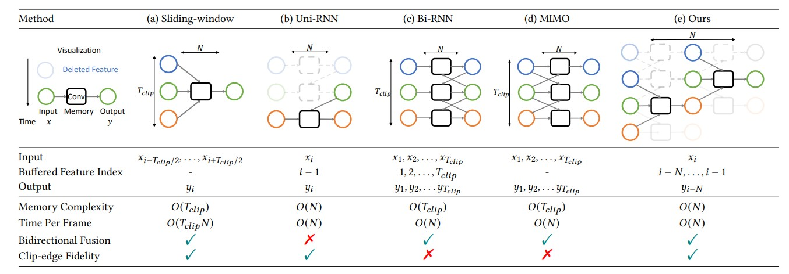

# BSVD

Official implementation for Real-time Streaming Video Denoising with Bidirectional Buffers (ACM MM 2022)

[project website](https://chenyangqiqi.github.io/BSVD/index.html) | [paper](https://arxiv.org/abs/2207.06937)


---
## Dependencies and Installation
### Environment
This code is based on PyTorch and [BasicSR](https://github.com/xinntao/BasicSR) repo. It has been tested on Ubuntu 18.04 LTS and CUDA 11.1.

Create a new conda environment with:
```
conda create --name bsvd python=3.7
conda activate bsvd
```


We recommend you install this repo locall as:
```
pip install -r requirements.txt
cd BasicSR
python setup.py develop
cd ..
```
if you use CUDA 11 and get runtime error. Reinstall torch as:
```
pip uninstall torch
pip install torch==1.9.0+cu111 torchvision==0.10.0+cu111 torchaudio==0.9.0 -f https://download.pytorch.org/whl/torch_stable.html
```

We use Nvidia DALI loader to load video frames.
```
pip install --extra-index-url https://developer.download.nvidia.com/compute/redist/ nvidia-dali-cuda110==1.12.0
```
Our test environment is CUDA 11.1. You may find DALI loader for other CUDA version from their [github](https://github.com/NVIDIA/DALI/releases)

<!-- Install the dependency for performance profiling
```
pip install torchstat
pip install ptflops
pip install thop
``` -->

### Data

Download the DAVIS (for train and test) and Set8 dataset (for test) from [onedrive](https://hkustconnect-my.sharepoint.com/:f:/g/personal/cqiaa_connect_ust_hk/EsEDQhCpBhxPj3RsoPgMsJQBkCoEfHn9xOFDvR0-kNPsAw?e=iaVYOt). Keep the folder structure as
```
--bsvd
 |--BasicSR
 |--datasets
    |--DAVIS-training-mp4
    |--DAVIS-2017-test-dev-480p
    |--Set8
 |--Experimental_root
 |--***.py
```
---
## Test
You may also download the [pretrained checkpoint](https://hkustconnect-my.sharepoint.com/:u:/g/personal/cqiaa_connect_ust_hk/EW8106urmu9KiNQlpE1QdVkBCcJBU4_sfMevqkkCDMCvuw?e=HIjXVI).
Put it under ``.experiments/pretrained_ckpt``. Then, run the command to produce the result in the Table2 from paper

```bash
python ./run_test.py -opt ./options/test/bsvd_c64.yml
```
---
## Train

```bash
CUDA_VISIBLE_DEVICES=0,1 python ./run.py -opt ./options/train/bsvd_c64_unblind.yml
```
We train the model on 2 RTX 3090 GPU for 2 days.
Here is one [example log and tensorboard] (https://hkustconnect-my.sharepoint.com/:f:/g/personal/cqiaa_connect_ust_hk/EqonQBPy6LZBm3nCsOGRd1EBsO3CgEMpRKoCnNH6YDof7w?e=197o0V) for our training.
---

## Profile the model
Type in command line

    python profile.py

Example output

    __file__ profile.py
    Disable distributed.
    device_name CUDA
    os.environ["CUDA_VISIBLE_DEVICES"] 2
    device cuda
    load from ./experiments/pretrained_ckpt/bsvd-64.pth
    <Experimental_root.models.denoising_model.DenoisingModel object at 0x7f3187110710>
    size of tensor torch.Size([1, 10, 4, 540, 960])
    use device  cuda
    output shape is torch.Size([1, 10, 3, 540, 960])
    size of tensortorch.Size([1, 10, 4, 540, 960])
    use device cuda

    test function name: <class 'Experimental_root.archs.bsvd_arch.BSVD'>
    10 loops, mean of best 1: 0.353594 sec per loop
    max memory required              2.26GB

## Codes Development

We support all functions provided by BasicSR natively. 
You may check the [docs](https://github.com/XPixelGroup/BasicSR/tree/master/docs) of BasicSR for details of file structure and installation.

To extend functions, please create your codes here:

    /Experimental_root
    |- models       # Custom Training and validation Behaviour
    |- archs        # Custom network architectures
    |- data         # Custom dataloader

## Citation
If you find this work useful for your research, please cite:
```
    @inproceedings{qi2022BSVD,
        title={Real-time Streaming Video Denoising with Bidirectional Buffers},
        author={Chenyang Qi and Junming Chen and Xin Yang and Qifeng Chen},
        booktitle = {ACM MM},
        year={2022}
        }
}
```

## Contact

Please contact us if there is any question (Chenyang QI, cqiaa@connect.ust.hk; Junming CHEN, jeremy.junming.chen@connect.ust.hk)
